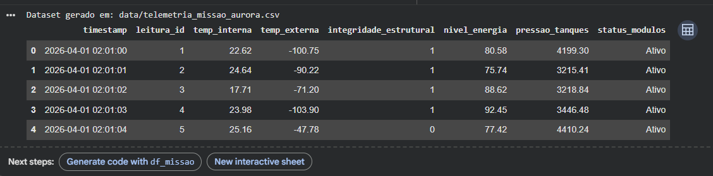
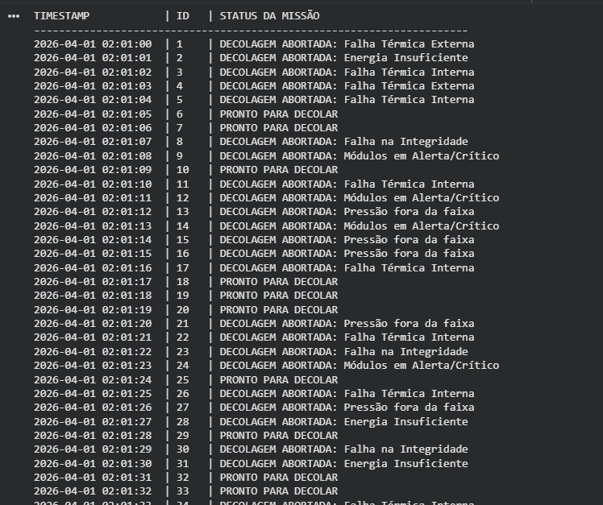

#  RELATÓRIO OPERACIONAL DE PRÉ-DECOLAGEM DA MISSÃO AURORA SIGER

Este projeto consiste em criar um relatório operacional de pré-decolagem  para missão aurora siger, desenvolvido para o curso de Ciência da Computação (CCOA1) da **FIAP**. 

O projeto é capaz de gerar um dataset sintético que simula dados críticos de sensores, analisar a viabilidade de voo com base em critérios de segurança rigorosos e realizar cálculos de autonomia energética.

## Explicação do Projeto
O Relatório operaciona de pré-decolagem da missão aurora siger está dividido em quatro etapas principais:
1. **Geração de Dados:** Criação de um dataset sintético congruente com a realidade de uma nave espacial.
2. **Análise (ABORTAR MISSÃO/PROTO PARA DECOLAR):** Um algoritmo que valida sensores (temperatura, pressão, energia e integridade) para decidir se a decolagem deve ser abortada.
3. **Cálculo Energético:** Aplicação de fórmulas físicas para prever a reserva de energia após o esforço da decolagem.
4. **Inteligência Artificial:** Uso de IA para detectar anomalias de tendência e padrões de risco não lineares.

---

## Prints da Execução

### 1. Geração do Dataset
*O sistema cria a pasta `/data` e o arquivo `.csv` automaticamente dentro do workspace do Google Colab*

### 2. Log de Verificação
*Visualização do algoritmo decidindo o status de cada segundo da missão.*

---

## Instruções de Execução

Siga os passos abaixo para rodar o projeto no **Google Colab**:

1.  **Acesse o Notebook:** Abra o arquivo `.ipynb` fornecido através do Google Colab.
2.  **Executar Geração do dataset:** Rode a célula de código célula da seção 1 do notebook para criar o diretório de dados e o arquivo `telemetria_missao_aurora.csv`.
3.  **Processar Análise:** Execute a célula de código da seção 4. O script lerá o CSV e imprimirá o status de decolagem no console.
4.  **Verificar Resultados:** * Os logs aparecerão diretamente na tela.
    * Um arquivo chamado `resultado_analise_missao.csv` será gerado na pasta `/data` com os vereditos finais.
5.  **Análise Energética:** Rode a célula de código da seção 5 que faz os cálculos matemáticos para visualizar a autonomia da nave.

---

## Tecnologias Utilizadas
* **Python 3.x**
* **Pandas** (Manipulação de dados)
* **Google Colab** (Ambiente de execução)
* **LaTeX** (Documentação de fórmulas matemáticas)

---
**Desenvolvido por:** José Rodrigues - [FIAP - 2026 - CC0A1]